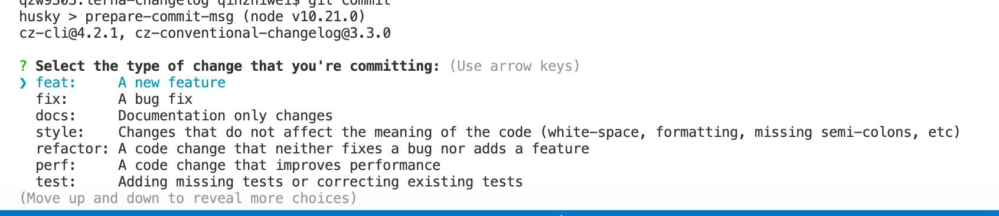
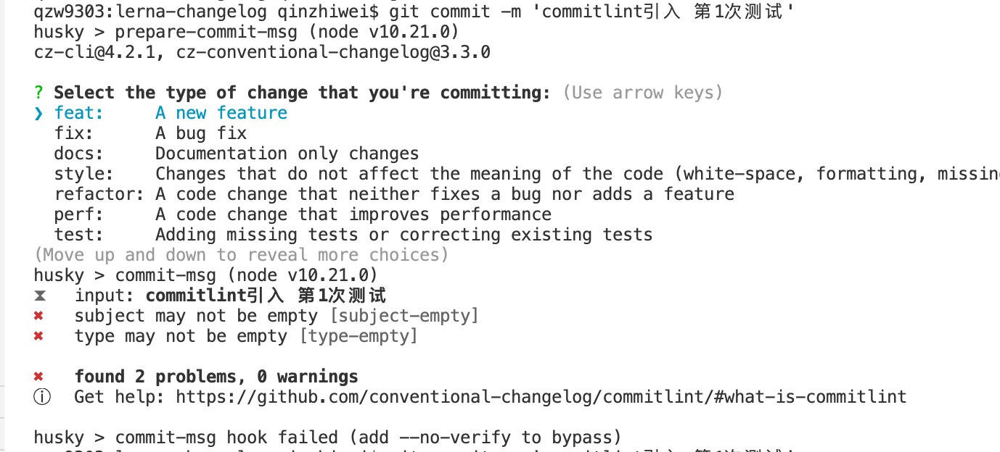

# 记录使用 Lerna 构建多包存储库的全流程

[](http://commitizen.github.io/cz-cli/)

## 初始化一个 lerna 仓库

1.这里使用**单独版本控制**
`lerna init --independent`

2.使用`yarn`客户端和`workspaces`

```json
// package.json
{
    "private": true, // 必须在private:true的情况下才能开启workspaces
    "workspaces": ["packages/*"]
}

// lerna.json

{
    "useWorkspaces":true,
    "npmClient": "yarn"
}
```

3.安装项目的`lerna`和`lerna-changelog`
`npm install -D lerna lerna-changelog`

4.配置`lerna-changelog`标签，后期会使用该标签给 merged 分支打标记，并生成`CHANGELOG.md`内容

```json
{
    "changelog": {
        "repo": "vuejs/vue-cli",
        "nextVersion": "Unreleased",
        "labels": {
            "PR: New Feature": ":rocket: New Features",
            "PR: Breaking Change": ":boom: Breaking Changes",
            "PR: Bug Fix": ":bug: Bug Fix",
            "PR: Documentation": ":memo: Documentation",
            "PR: Internal": ":house: Internal",
            "PR: Underlying Tools": ":hammer: Underlying Tools"
        },
        "cacheDir": ".changelog"
    }
}
```

5.使用`lerna-changelog`必须在从 github 获取[Personal access tokens](https://github.com/settings/tokens)，然后本地环境变量添加`GITHUB_AUTH`。如果是私有仓库选择 scope `repo`，如果是公开的仓库选择 scope `public_repo`。


## 创建一个`package`

1.创建一个`package`
`lerna create @qinzhiwei1993/element1 --access public --es-module --license MIT`

2.基于 vue+element 封装业务组件

> 添加`vue`和`element-ui`同级相关依赖和本地启动编译执行文件

```json
// packages/element1/package.json
"scripts": {
    "dev": "vue-cli-service serve",
    "build": "vue-cli-service build",
  },
"devDependencies": {
    "@vue/cli-service": "^4.5.6", // 启动本地服务
    "sass": "^1.26.10",
    "sass-loader": "^10.0.2",
    "terser-webpack-plugin": "^4.2.0",
    "vue-template-compiler": "^2.6.12" // vue模板编译
  },
  "peerDependencies": { // 同级vue 和 element-ui依赖
    "element-ui": "^2.13.2",
    "view-design": "^4.3.2",
    "vue": "^2.6.12"
  }
```

> 配置本地服务用来启动 example

```javascript
// packages/element1/vue.config.js
const path = require('path')
const TerserPlugin = require('terser-webpack-plugin')
module.exports = {
    lintOnSave: false,
    runtimeCompiler: true,
    css: { extract: false },
    devServer: {
        // 热更新 打开
        hot: true,
        host: 'localhost',
        port: 3008,
    },
    // 扩展 webpack 配置
    chainWebpack: config => {
        config.entry('app').clear() // 清除之前的默认entry

        config // 自定义入口文件
            .entry('app')
            .add(path.resolve(__dirname, './examples/main.js'))
            .end()

        config.resolve.alias.set('@', path.resolve(__dirname, './src'))
    },

    // 打包优化
    configureWebpack: {
        optimization: {
            minimizer: [
                new TerserPlugin({
                    terserOptions: { compress: { drop_console: true } },
                }),
            ],
        },
    },
    productionSourceMap: true,
}
```

> 在项目根目录配置脚本，执行`element1/package.json`中的脚本

```javascript
// package.json
"scripts": {
    "dev:element1": "lerna exec --scope @qinzhiwei1993/element1 -- npm run dev"
}

```

> 添加基于 element 组件的业务组件 `/packages/element1/packages`

> 自动生成 element1 组件库的入口文件，入口文件位置在`/packages/element1/src/index.js`

`scripts/build/bin/build-entry.js`

> 获取当前 package 版本号，赋予本地

`scripts/build/bin/version.js`

> element1 业务组件打包输出

## 基于[Commitizen](https://github.com/commitizen/cz-cli)、[commitlint](https://github.com/conventional-changelog/commitlint)和[conventional-changelog](https://github.com/ajoslin/conventional-changelog)`生成CHANGELOG.md`

1.安装本地 commitizen，采用命令行交互的方式提交 commit 信息

`npm install -D commitizen`



2.使项目支持 Angular 的 Commit message 格式，添加适配器
`commitizen init cz-conventional-changelog --save-dev --save-exact`

3.安装`husky`和[validate-commit-msg](https://github.com/conventional-changelog-archived-repos/validate-commit-msg)校验提交 commit-msg

```json
{
    "husky": {
        "hooks": {
            "prepare-commit-msg": "exec < /dev/tty && git cz --hook || true", // 对git commit拦截，使项目维护人员统一使用commitizen
            "commitmsg": "validate-commit-msg"
        }
    }
}
```

> `validate-commit-msg`注意事项: 这种方式已经被官方启用，使用[commitlint](https://github.com/conventional-changelog/commitlint)代替: 1.遵循格式: `<type>(<scope>): <subject>`。2.本地添加.vcmrc 文件配置校验文件

```json
{
    // 接受的type类型
    "types": [
        "feat",
        "fix",
        "docs",
        "style",
        "refactor",
        "perf",
        "test",
        "build",
        "ci",
        "chore",
        "revert"
    ],
    // scope相关
    "scope": {
        "required": false,
        "allowed": ["*"],
        "validate": false,
        "multiple": false
    },
    "warnOnFail": false, // true时报错但是会提交
    "maxSubjectLength": 100,
    "subjectPattern": ".+", // subject部分内容检验 regExp格式
    "subjectPatternErrorMsg": "subject does not match subject pattern!",
    "helpMessage": "pattern: <type>(<scope>): <subject>", // 错误提示信息
    "autoFix": false
}
```

4.使用`commitlint`代替`validate-commit-msg`，校验上传 commit-msg 是否符合规范

```bash
# 版本要求
Node.js LTS >= 10.21.0
git >= 2.13.2
```

```bash
# Install commitlint cli and conventional config
npm install --save-dev @commitlint/{config-conventional,cli}
# For Windows:
npm install --save-dev @commitlint/config-conventional @commitlint/cli

# Configure commitlint to use conventional config
# 在默认@commitlint/config-conventional基础上做部分变更
echo "module.exports = {extends: ['@commitlint/config-conventional']}" > commitlint.config.js
```

```json
// 结合husky 做git hooks拦截
{
    "husky": {
        "hooks": {
            "commit-msg": "commitlint -E HUSKY_GIT_PARAMS"
        }
    }
}
```



5.安装[conventional-changelog](https://github.com/ajoslin/conventional-changelog)生成 CHANGELOG.md

如果你的所有 Commit 都符合 Angular 格式，那么发布新版本时， Change log 就可以用脚本自动生成

生成的文档包括以下三个部分：

-   New features
-   Bug fixes
-   Performance Improvement
-   Breaking changes.

每个部分都会罗列相关的 commit ，并且有指向这些 commit 的链接。当然，生成的文档允许手动修改，所以发布前，你还可以添加其他内容

具体使用方案如下：

```bash
$ npm install -g conventional-changelog
$ cd my-project
$ conventional-changelog -p angular -i CHANGELOG.md -w
```

上面命令不会覆盖以前的 Change log，只会在 CHANGELOG.md 的头部加上自从上次发布以来的变动。

**首次使用该命令时，使用下面命令，生成之前所有的变更到 CHANGELOG.md 中:**

```bash
$ conventional-changelog -p angular -i CHANGELOG.md -w -r 0
```

```bash
# cli Options

    -i, --infile              Read the CHANGELOG from this file

    -o, --outfile             Write the CHANGELOG to this file
                              If unspecified, it prints to stdout

    -s, --same-file           Outputting to the infile so you don't need to specify the same file as outfile

    -p, --preset              Name of the preset you want to use. Must be one of the following:
                              angular, atom, codemirror, ember, eslint, express, jquery, jscs or jshint

    -k, --pkg                 A filepath of where your package.json is located
                              Default is the closest package.json from cwd

    -a, --append              Should the newer release be appended to the older release
                              Default: false

    -r, --release-count       How many releases to be generated from the latest
                              If 0, the whole changelog will be regenerated and the outfile will be overwritten
                              Default: 1

    --skip-unstable           If given, unstable tags will be skipped, e.g., x.x.x-alpha.1, x.x.x-rc.2

    -u, --output-unreleased   Output unreleased changelog

    -v, --verbose             Verbose output. Use this for debugging
                              Default: false

    -n, --config              A filepath of your config script
                              Example of a config script: https://github.com/conventional-changelog/conventional-changelog/blob/master/packages/conventional-changelog-cli/test/fixtures/config.js

    -c, --context             A filepath of a json that is used to define template variables
    -l, --lerna-package       Generate a changelog for a specific lerna package (:pkg-name@1.0.0)
    -t, --tag-prefix          Tag prefix to consider when reading the tags
    --commit-path             Generate a changelog scoped to a specific directory
```

打包构建

lerna-changelog

http://www.ruanyifeng.com/blog/2016/01/commit_message_change_log.html
conventional-changelog

.version
