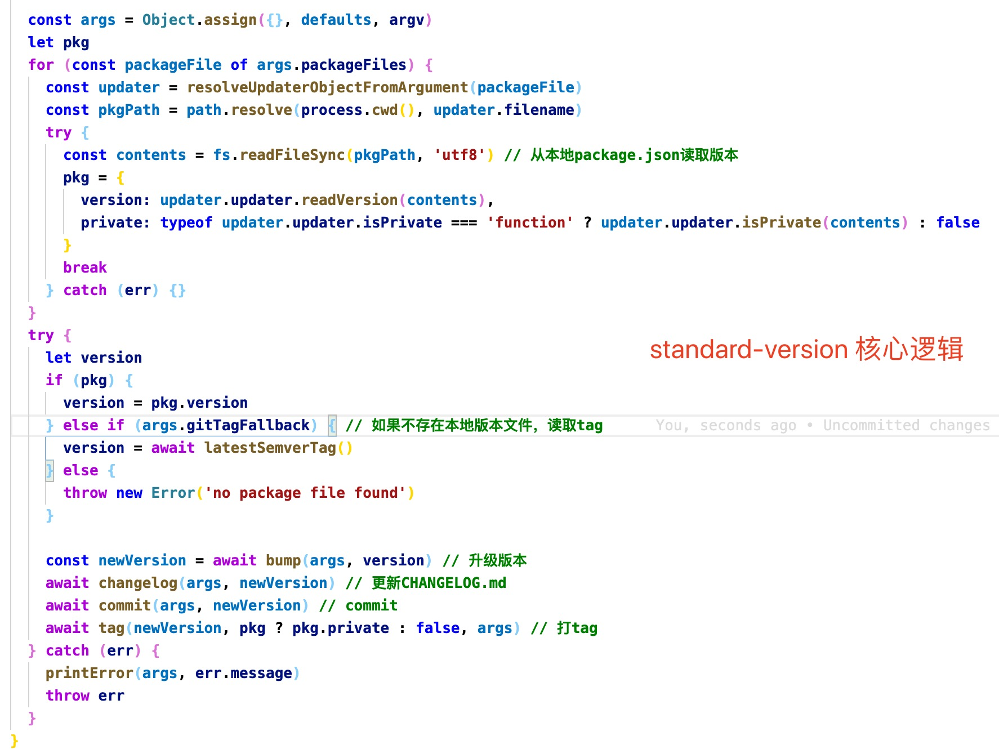

# standard-version

基于[semver](https://semver.org/)(Semantic Versioning)和[Conventional Commits](https://www.conventionalcommits.org/en/v1.0.0/)进行版本变更和生成 changeLog 的实用工具

---

工作原理:

1. 存储库必须遵循[Conventional Commits Specification](https://conventionalcommits.org/)提交`commit`
2. 准备好发布后，运行`standard-version`

`standard-version`作了以下几件事:

1. 通过查看[packageFiles](https://github.com/conventional-changelog/standard-version#bumpfiles-packagefiles-and-updaters)来获取当前版本，然后回到最后一个`git tag`
2. 基于提交的 commits 在[bumpFiles](https://github.com/conventional-changelog/standard-version#bumpfiles-packagefiles-and-updaters)升级版本
3. 基于提交的 commits 生成`changelog`，背后使用的是[conventional-changelog](https://github.com/conventional-changelog/conventional-changelog)
4. 创建一个新的 commit（包含`bumpFiles`和更新的`CHANGELOG`）
5. 基于新的版本创建`tag`



### 快速开始

1. 安装依赖

`npm install --save-dev standard-version`

2. 在`package.json`中添加脚本

```json
{
    "scripts": {
        "release": "standard-version"
    }
}

// npm run release
```

3. 第一次发布

`npm run release -- --first-release`

4. 参数

```js

npm run release -- --prerelease //1.0.1-0
npm run release -- --prerelease alpha //1.0.1-alpha.0
npm run release -- --release-as minor //1.0.0 -> 1.1.0
npm run release -- --release-as 1.1.0 //1.0.0 -> 1.1.0

```

5. 生命周期

1. `prerelease`: executed before anything happens. If the prerelease script returns a non-zero exit code, versioning will be aborted, but it has no other effect on the process.
2. `prebump/postbump`: executed before and after the version is bumped. If the prebump script returns a version #, it will be used rather than the version calculated by standard-version.
3. `prechangelog/postchangelog`: executes before and after the CHANGELOG is generated.
4. `precommit/postcommit`: called before and after the commit step.
5. `pretag/posttag`: called before and after the tagging step.

```json
// package.json
{
    "standard-version": {
        "scripts": {
            "prebump": "echo 9.9.9"
        }
    }
}
```

### 配置

可以通过多种方式配置

1. 在`package.json`中添加`standard-version`属性
2. 创建`.versionrc`或者`.versionrc.json`或者`.versionrc.js`
    - 如果使用`.versionrc.js`，需要导出一个对象，或者方法导出一个对象

可配置属性参考[conventional-changelog-config-spec](https://github.com/conventional-changelog/conventional-changelog-config-spec/)

```js
// .versionrc.js
// hidden: true 不在CHANGELOG中输出
module.exports = {
    header: 'Changelog', // 导出文件的title
    types: [
        { type: 'feat', section: '✨ Features | 新功能' },
        { type: 'fix', section: '🐛 Bug Fixes | Bug 修复' },
        { type: 'chore', hidden: true }, // 不输出
        { type: 'docs', hidden: true }, // 不输出
        { type: 'style', hidden: true }, // 不输出
        { type: 'refactor', hidden: true }, // 不输出
        {
            type: 'perf',
            section: '⚡ Performance Improvements | 性能优化',
            hidden: true, // 不输出
        },
        { type: 'test', hidden: true }, // 不输出
    ],
}
```

**注意事项:**

如果使用的是`GitLab`而不是`GitHub`，以下变量需要替换：

1. `commitUrlFormat`: the URL format of commit SHAs detected in commit messages.
2. `compareUrlFormat`: the URL format used to compare two tags.
3. `issueUrlFormat`: the URL format used to link to issues.

---

参考链接

1.[https://github.com/conventional-changelog/standard-version](https://github.com/conventional-changelog/standard-version)
